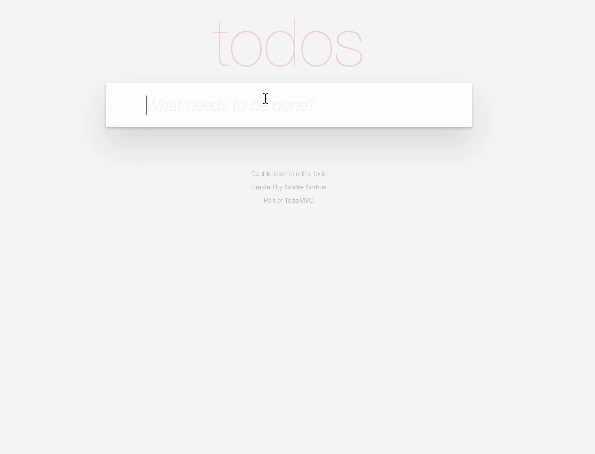

# TodoMVC App

Diese ToDo-App wurde mit jQuery und Handlebars gemacht. Aber sie hat Kompatibilitäts- und Performance-Probleme, deshalb:

1. Tausche die verwendeten jQuery-Methoden in `app.js` gegen JavaScript(ES6+) aus.

_Achtung:_ Der konvertierte Code sollte weiterhin Handlebars verwenden.

**Tipp:** Die `bind()`-Methode gibt dir die Möglichkeit, den Kontext von `this` in einer anderen Funktion beizubehalten.

> Orientiere dich an der Abbildung unten.

